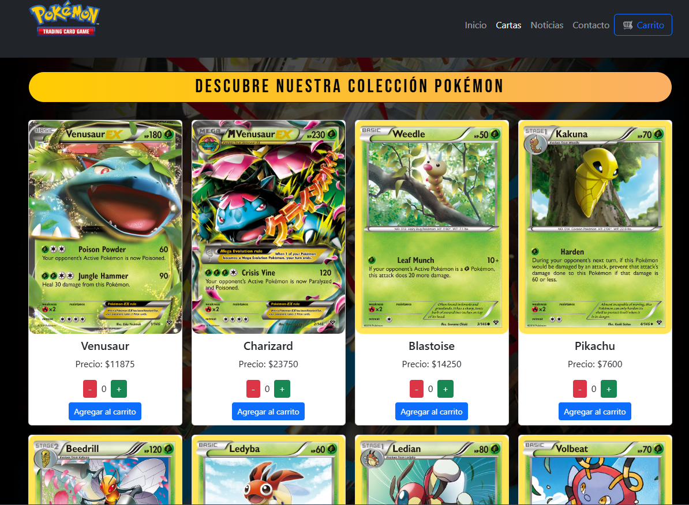
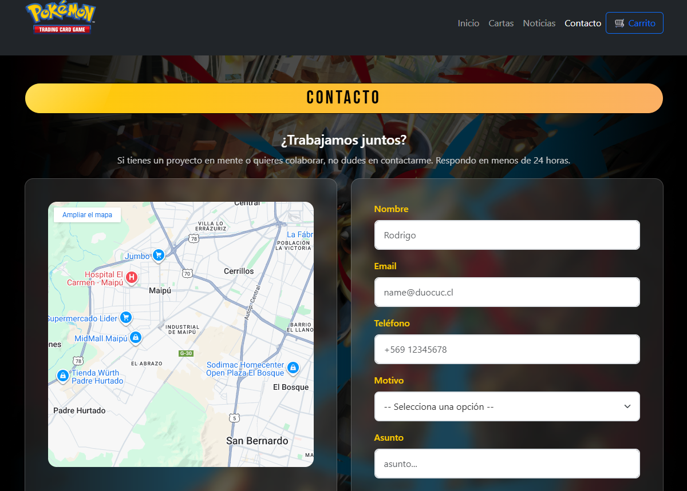
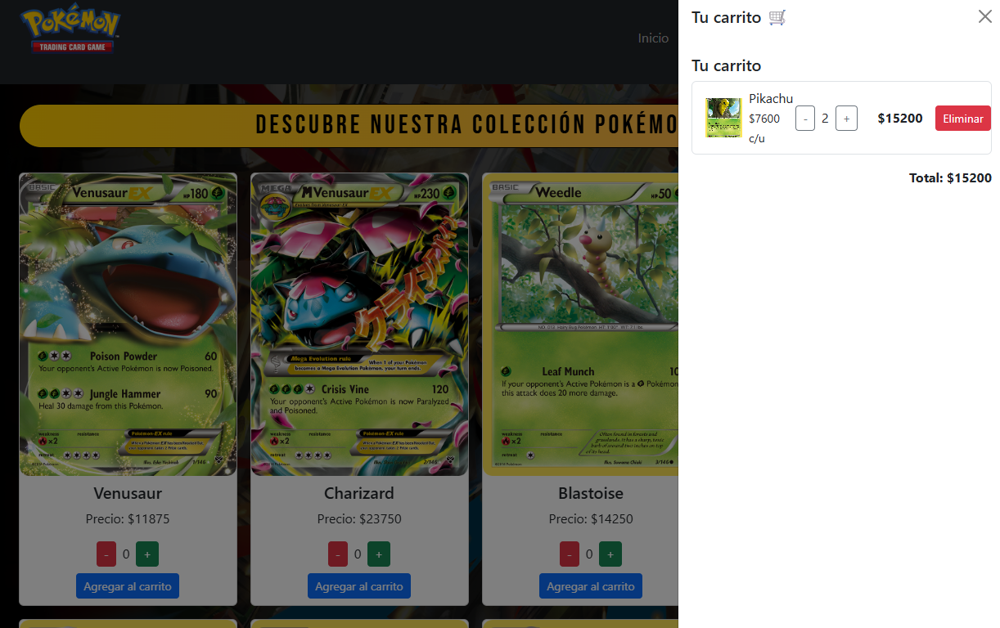

# POKECARD STORE

## Descripción
PokeCardStore es una aplicación web desarrollada en React + TypeScript que permite a los usuarios explorar una tienda de cartas Pokémon, visualizar cada carta  y agregarlas a un carrito de compras.

Además, cuenta con un diseño responsive basado en Bootstrap, asegurando una visualización correcta en diferentes dispositivos.

## Visuales







## Uso 
Una vez que la aplicación esté en ejecución, podrás navegar por las diferentes secciones:

### 🛒 Tienda de Cartas
- Visualiza el catálogo de cartas Pokémon disponibles.
- Agrega cartas al carrito utilizando los botones **+** y **-** para ajustar cantidades.
- Puedes ver los detalles del carrito en todo momento en la parte superior.

### 📰 Noticias Pokémon
- Revisa una sección de noticias relacionadas con el mundo Pokémon.
- Cada noticia incluye título, imagen, descripción y un enlace que abre en una nueva pestaña.

### ✉️ Formulario de Contacto
- Completa el formulario para enviar tus consultas.
- Los campos se validan antes de permitir el envío.
- Al enviar, se mostrará un mensaje confirmando la acción.

### Prerrequisitos ✅
Antes de instalar y ejecutar el proyecto, asegúrate de contar con lo siguiente:

- **Node.js** v16 o superior  
  Descarga: https://nodejs.org/

- **npm** como gestor de paquetes (instalado junto con Node.js)

- Navegador web actualizado (Chrome, Edge, Firefox, etc.)

### Instalación 🔧
A continuación, se presenta una guía paso a paso para configurar el entorno de desarrollo y realizar la instalación de todas las dependencias necesarias:

Clona este repositorio:

```bash
git clone https://github.com/Deimonlay13/PokeCardStore.git
```
Accede a la carpeta del proyecto:
```bash
cd PokeCardStore
```
Instala las dependencias:
```bash
npm install
```
Inicia el servidor de desarrollo:
```bash
npm run dev
```

El proyecto estara disponible en:
- http://localhost:5173/


## Testing 🧪 
Para  testear se utilizaron las siguientes herramientas:
- Jasmine — Framework de pruebas
- Karma — Test runner
- karma-coverage — Reportes de cobertura

Para ejecutar las pruebas unitarias:
```bash
npm test
```

Para ver el reporte de cobertura:
```bash
npm run test:coverage
```


## Despliegue 📦
En el siguiente enlace podras ver el proyecto: 

https://poke-card-store-gamma.vercel.app/

## Construido Con 🛠️
**Frameworks y Librerías principales**
- React 19 — Librería para construcción de interfaces
- React Router DOM 7 — Navegación y enrutamiento
- React Bootstrap — Componentes UI basados en Bootstrap
- Bootstrap 5 — Estilos y diseño responsivo

**Herramientas de desarrollo**
- Vite — Servidor de desarrollo y bundler
- TypeScript — Tipado estático para JavaScript

**Testing**
- Jasmine — Framework de tests
- Karma — Test runner en navegador
- karma-coverage — Reporte de cobertura

**Compilación y transformación**
- Babel — Transpilación de JS/TS/React
- Webpack — Empaquetado para pruebas (karma)
  
## Versionado 📌

Usamos [Git](https://git-scm.com) para el versionado.


##  Autores / Contribuidores 👥
[Geraldine Becerra](https://github.com/GeraldineBecerra) - [Luis Muñoz](https://github.com/Luis-Munoz-soto) -
[Diego Pizarro](https://github.com/Deimonlay13) 😊

